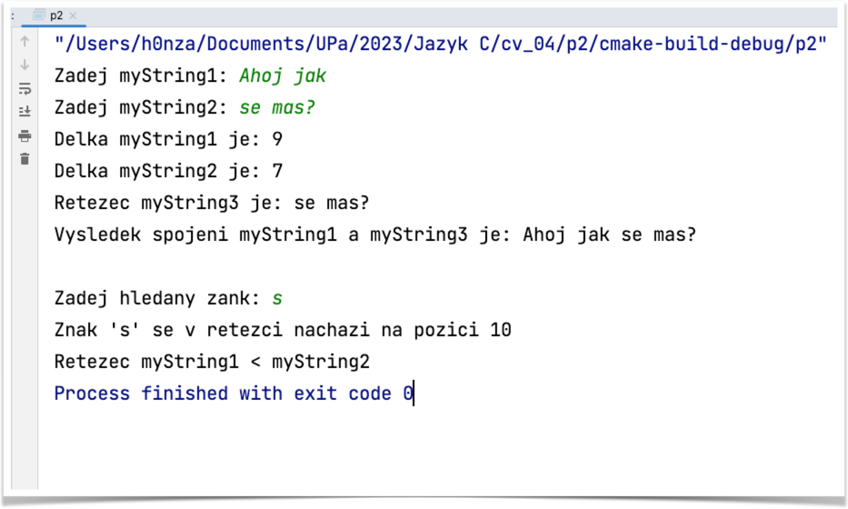

# Příklad 2
## práce s řetězci

Mějme definici:

```
char myString1[20], myString2[20], myString3[20], myChar;
char *p_myString = NULL;
int comparison = 0;
```

Načtěte řetězce myString1 a myString2. Zjistěte a vypište délku obou řetězců.

Zkopírujte `myString2` do `myString3`.

Připojte `myString3` k `myString1` a vypište.

Do proměnné `myChar` načtěte z klávesnice hledaný znak a zjistěte, zda se nachází v řetězci `myString1`.
Pokud ano, nastavte ukazatel `p_myString` vypište pomocí rozdílu, na jaké pozici.

Porovnejte `myString1` a `myString2` a výsledek uložte do comparison a vypište, který je větší? (Případně, zda si jsou rovny)

